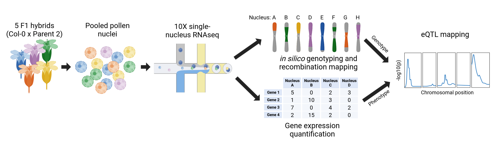

# Recombination and eQTL mapping in recombinant gametes

### *A rapid expression quantitative trait locus analysis approach using single cell or nucleus RNA sequencing (snRNAseq) of gametes from a small number of heterozygous individuals.*

This repo contains snakemake pipelines, python scripts, and jupyter notebooks to reproduce the results of ***Parker et al., 2024, Expression quantitative trait locus mapping in recombinant gametes using single nucleus RNA sequencing.***

This includes:

* Synteny analysis of parental genomes to identify high quality markers for genotyping and recombination analysis.
* Genotyping analysis and demultiplexing of cell barcodes that represent recombinant gametes originating from genetically different parental F1 hybrids.
* Spliced alignment of snRNAseq reads to both parental haplotypes simultaneously, using [STAR diploid](https://github.com/alexdobin/STAR.git).
* A method for inferring recombination breakpoints and inherited haplotypes from sequenced markers for each gamete, using rigid hidden Markov models.
* Methods for performing eQTL analysis from inferred haplotypes and paired gene expression from each cell barcode.